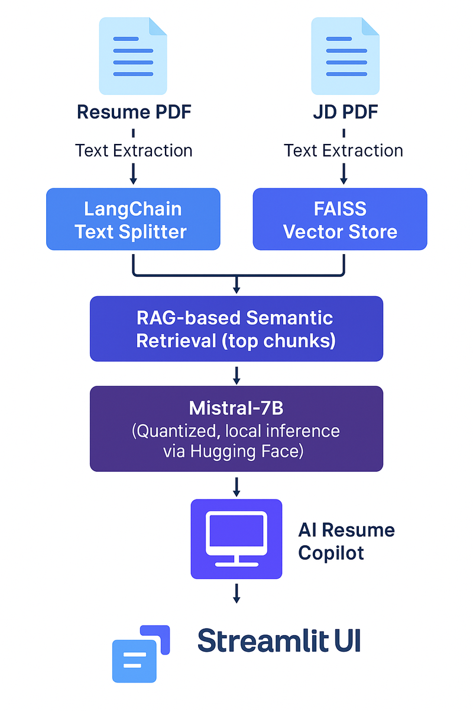

# 🧠 AI Resume Copilot

**AI Resume Copilot** is a local AI-powered assistant that analyzes your resume and a job description using **open-source LLMs (like Mistral-7B)** and **Retrieval-Augmented Generation (RAG)** to offer tailored improvement suggestions. It helps you fine-tune your resume for maximum alignment with any job — all processed locally with privacy in mind.

---

<!-- ## 📛 Badges


 

---    -->

## 🔍 What It Does

Upload your **resume (PDF)** and a **job description (PDF)**. The app will automatically:
- ✅ Extract key skills from both documents
- 🧠 Identify missing skills in the resume compared to the job description
- 💬 Perform end-to-end analysis using structured LLM prompts:
  - Initial job requirement extraction
  - Resume skill summary
  - Gap analysis and optimization
  - Suggestions to rewrite Professional Summary, Experience, and Skills
  - Final clarity and impact review
- 🛠 Generate personalized improvement tips in natural language

---

## 🛠 Tech Stack

| Tool | Purpose |
|------|---------|
| [LangChain](https://www.langchain.com/) | RAG pipeline (retriever + semantic chunking) |
| [FAISS](https://github.com/facebookresearch/faiss) | Fast semantic search over resume + JD |
| [Streamlit](https://streamlit.io/) | Interactive web UI |
| [HuggingFace Transformers](https://huggingface.co/models) | Loads open-source LLMs like Mistral |
| Python 3.11 | Core backend logic |

---

## 🚀 Demo

📺 Coming soon: [Watch demo](#)  
<!-- 🌐 Try it live: [Streamlit Share](#) *(optional)* -->

---

## 🧭 Architecture Diagram



---

## 📦 Installation

```bash
git clone https://github.com/sohansputhran/ai-resume-copilot.git
cd ai-resume-copilot
pip install -r requirements.txt
streamlit run app/main.py
```

> ⚠️ Make sure you have GPU and enough VRAM (~6GB+) to load Mistral-7B locally.

---

## 📁 Project Structure

```
ai-resume-copilot/
├── app/                        # Streamlit UI
│   └── main.py
├── rag/                        # RAG and agent logic
│   ├── llm_local.py            # Mistral LLM pipeline using HuggingFace
│   ├── prompt_templates.py
│   └── retriever.py            # FAISS + LangChain retriever
├── data/                       # Sample resumes and job descriptions
├── assets/                     # Screenshots, diagrams
├── requirements.txt
├── utils.py                    # PDF extraction, skill extraction, etc.
└── README.md
```

---

## ✅ Features

- 📄 Resume & JD PDF upload
- 🧠 Open-source LLM-powered recommendations
- 🔍 Resume-vs-JD gap detection
- ✍️ Suggestions to rewrite resume sections
- 🎯 Missing skill identification (natural language)
- 🧑‍💻 All inference runs locally with no external API

---

## 💡 Future Enhancements

- [ ] ATS keyword alignment score
- [ ] Resume section-by-section auto-editing
- [ ] Download suggestions as PDF or `.txt`
- [ ] Job title & company name extraction
- [ ] UI tabs for step-by-step insights
- [ ] Multi-resume comparison mode

---

## 🤝 Contributing

Pull requests are welcome! For major changes, please open an issue first.  
If you find this useful, consider ⭐ starring the repo!

---

## 📄 License

This project is licensed under the MIT License.

---

## 📬 Contact

📧 Sohan Puthran  
🌐 [Portfolio Website](https://sohansputhran.github.io)  
🔗 [LinkedIn](https://www.linkedin.com/in/sohan-puthran/)
